# 🍪 Croissant Ecosystem

> *An open-source, commission-free platform for gamers, creators, and developers.*

    

  

  
  
  
  

  

---

## 🌐 Overview

Croissant is a **modular ecosystem** that enables:

* 🎮 **Gamers** — manage, trade, and give a second life to digital items.
* 🛠️ **Developers** — integrate inventory, authentication, and marketplace features.
* 🎨 **Creators** — monetize work in a **0% commission marketplace**.
* 🤝 **Communities** — connect via Discord bot, launcher, and VPN tools.

---

## 🛠️ Ecosystem Components

Here’s how Croissant fits together:

```mermaid
flowchart LR
    A[Website 🌍] -->|OAuth2 Login| B[API 🔌]
    B --> C[Marketplace 🛒]
    B --> D[Inventory 📦]
    B --> E[Lobbies 🎲]
    D --> F[Launcher 💻]
    D --> G[Bot 🤖]
    F --> H[Steam Integration 🎮]
    G --> I[Discord Community 💬]
    F --> J[Croissant VPN 🔐]
```

---

## 📦 Repositories

  
<b>🔌 API</b> — <i>The backbone of the ecosystem</i>
  

* [Croissant API](https://github.com/Croissant-API/API)
  RESTful backend providing authentication, inventory management, marketplace, and lobbies.

  

  
<b>🌠Website</b> — <i>Official web interface</i>
  

* [Croissant Website](https://github.com/Croissant-API/Website)
  User-friendly interface for marketplace, docs, and account management.

  

  
<b>💻 Launcher</b> — <i>Desktop application</i>
  

* [Croissant Launcher](https://github.com/Croissant-API/Launcher)
  Manages game sessions, Steam linking, and access to inventories/lobbies.

  

  
<b>🔠VPN</b> — <i>Privacy & connectivity</i>
  

* [Croissant VPN](https://github.com/Croissant-API/Croissant-VPN)
  OpenVPN wrapper for IP rotation, network privacy, and accessibility.

  

  
<b>🤖 Bot</b> — <i>Discord automation</i>
  

* [Croissant Bot](https://github.com/Croissant-API/Bot)
  Inventory management, trades, and lobbies directly in chat.

  

---

## 📊 At a Glance

| Component                                                           | Purpose                                             |
| ------------------------------------------------------------------- | --------------------------------------------------- |
| [**croissant-api.fr**](https://croissant-api.fr)                    | Main hub — marketplace, OAuth2, Steam linking, docs |
| [**API**](https://github.com/Croissant-API/API)                     | RESTful backend for all integrations                |
| [**Website**](https://github.com/Croissant-API/Website)             | Official frontend, user experience & docs           |
| [**Launcher**](https://github.com/Croissant-API/Launcher)           | Desktop launcher for games, lobbies, and inventory  |
| [**Croissant VPN**](https://github.com/Croissant-API/Croissant-VPN) | Free VPN wrapper for privacy & access               |
| [**Bot**](https://github.com/Croissant-API/Bot)                     | Discord integration for players & communities       |

---

## 🤝 Contributing

We welcome contributions!
You can help by improving:

* The **API** (new endpoints, performance, docs)
* The **Website** (UI/UX improvements, marketplace features)
* The **Launcher** (Steam support, inventory tools)
* The **VPN** (protocol support, automation)
* The **Bot** (new commands, better integrations)

Start here → [Croissant-API on GitHub](https://github.com/Croissant-API)

---

## 🌟 Vision

Croissant’s mission is to build an **inclusive, commission-free, and accessible ecosystem** where:

* **Gamers** can extend the life of their items,
* **Creators** retain 100% of their revenue,
* **Communities** thrive with tools built around simplicity, inclusivity, and innovation.

---

👉 [Explore the Platform](https://croissant-api.fr) | [Join Development](https://github.com/Croissant-API) | [Join the Discord](https://discord.gg/croissant)
